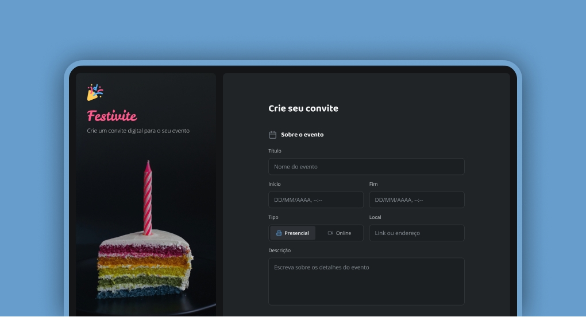

# --Formulário de Convite 🎊

Um formulário em HTML e CSS completo para o uso em criação de convites para festas, contando com titulos, imagens e estilização de cores personalizadas para seu salão!😁

## 📸 Preview



## ✨ Funcionalidades

- ✅ links
- ✅ Responsivo

## 🚀 Tecnologias

- HTML
- CSS

## ▶️ Como executar

```bash
# Clone o repositório
git clone https://github.com/JouberthAlves/formularios-html.git

# Entre na pasta
cd formularios-html

# Abra o index.html

# Execute com o live server

## 👤 Autor

- Jouberth Alves Macedo